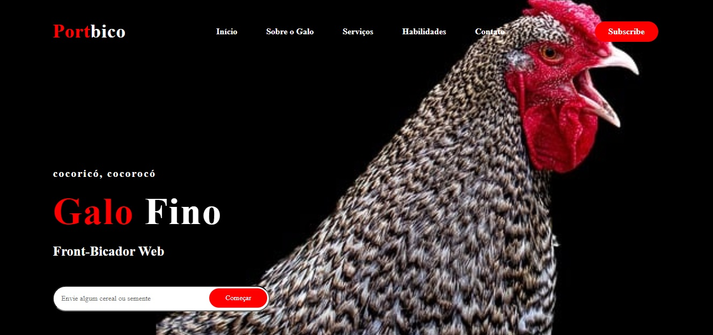

   

##  🖥️ Projeto
Um portfólio engraçado sobre um galo frontal bicador web. Uma leve brincadeira para codificar e aprender ainda mais de CSS e HTML.  

##  🚀 Tecnologias
Nesse projeto, foi utilizando as seguintes tecnologias:  

- HTML ✅
- CSS ✅